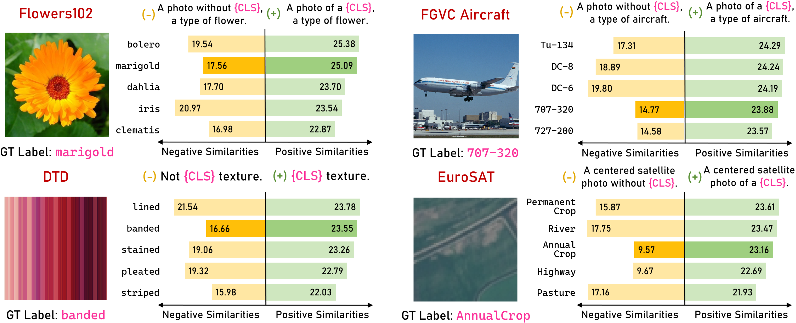
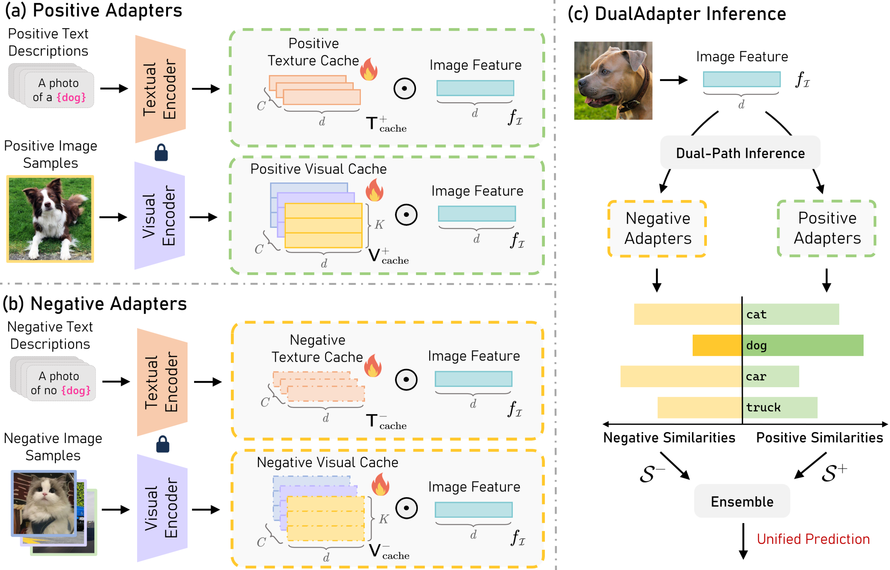

# DualAdapter

[](https://arxiv.org/abs/2401.07457)[](https://opensource.org/licenses/MIT)

## 👀Introduction

This repository contains the code for our paper `Negative Yields Positive: Unified Dual-Path Adapter for Vision-Language Models`. [[Paper](https://arxiv.org/abs/1111.11111)]





## ⏳Setup

#### 1. Environment

We test our codebase with PyTorch 1.12.1 with CUDA 11.6. Please install corresponding PyTorch and CUDA versions according to your computational resources. Then install the rest of required packages by running `pip install -r requirements.txt`. 

#### 2. Dataset

Please follow the following file provided by  [Tip-Adapter](https://github.com/gaopengcuhk/Tip-Adapter) to download all the 11 datasets we used for experiments: https://github.com/gaopengcuhk/Tip-Adapter/blob/main/DATASET.md

#### 3. Extracting Few-Shot Features

You can extract the features by running ``` CUDA_VISIBLE_DEVICES=0 python extract_features.py```.

 After running, you can get all the image features from tran/val/test set, as well as the positive/negative textual features in ```caches/[dataset_name]```.

## 📦Usage

You can simply run ```CUDA_VISIBLE_DEVICES=0 python main.py --config configs/[dataset_name].yaml --shot [shot_number]``` to train and test the DualAdapter model. 

Here, `dataset_name` should be one of `[caltech101, dtd, eurosat, fgvc, food101, imagenet, oxford_flowers, oxford_pets, stanford_cars, sun397, ucf101]`, and `shot_number` is chosen from 1/2/4/8/16.

## 🙏Acknowledgements

Our codebase is adapted from [TIP-Adapter](https://github.com/gaopengcuhk/Tip-Adapter/), [CLIP](https://github.com/openai/CLIP/tree/main/clip), [APE](https://github.com/yangyangyang127/APE), and [CuPL](https://github.com/sarahpratt/CuPL). We thank the authors for releasing their code!

## 📧Contact

If you have any questions, please  contact at [cezhang@cs.cmu.edu](mailto:cezhang@cs.cmu.edu).

## 📌 BibTeX & Citation

If you find this code useful, please consider citing our work:

```bibtex
To be updated.
```

